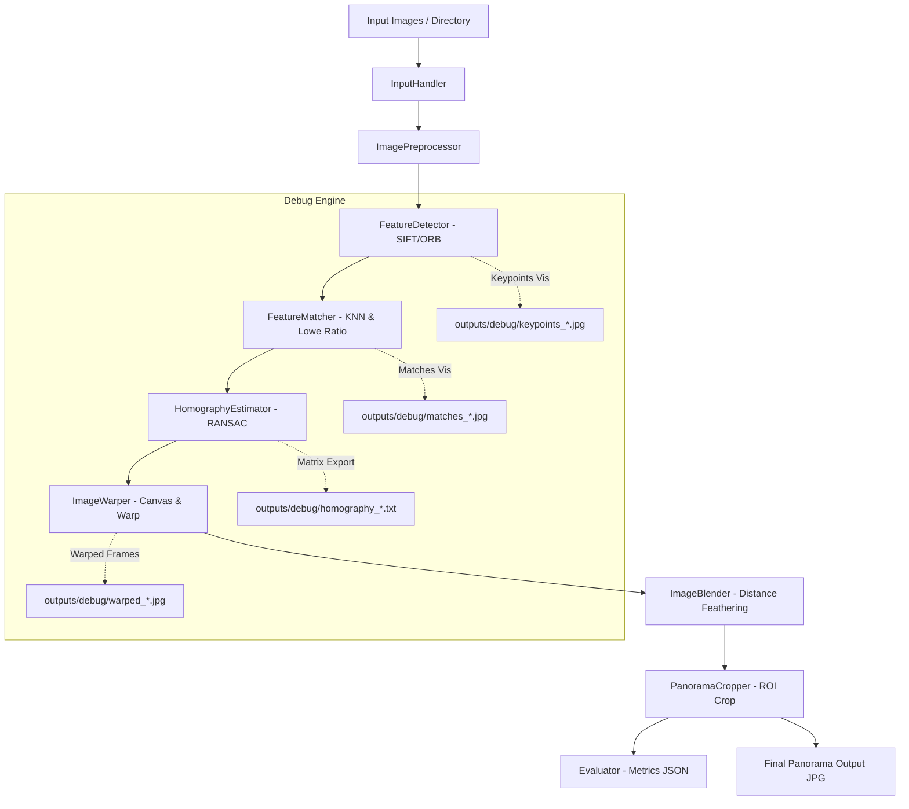

# System Architecture

The **Intelligent Panorama Builder** system architecture follows a clean modular pipeline pattern.

## Architectural Component Descriptions
1. **InputHandler**: Discovers files, validates extensions (`.jpg`, `.png`, `.bmp`, `.webp`, `.tiff`), verifies image readability, and enforces minimum image count ($\ge 2$).
2. **ImagePreprocessor**: Resizes large images preserving aspect ratio (`max_dimension=1600`) to create working copies and converts BGR to single-channel grayscale.
3. **FeatureDetector**: Encapsulates SIFT and ORB algorithms to detect keypoints and compute descriptor matrices.
4. **FeatureMatcher**: Implements KNN matching ($k=2$) and filters false correspondences using Lowe's ratio test.
5. **HomographyEstimator**: Computes $3 \times 3$ transformation matrix using RANSAC outlier rejection and validates matrix rank/determinant.
6. **ImageWarper**: Calculates composite canvas dimensions, computes translation offset matrix $H_{trans}$, and warps images into a unified space.
7. **ImageBlender**: Generates distance-transform weight maps to blend overlapping image boundaries smoothly.
8. **PanoramaCropper**: Performs threshold-based contour bounding box extraction to remove dark padding borders.
9. **Evaluator**: Compiles quantitative metrics (keypoint counts, raw/good matches, inliers, inlier ratio, reprojection error, timing, dimensions) into `outputs/metrics.json`.
