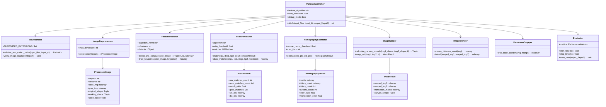

# Class & Component Diagram

The class diagram describes object-oriented class structure, attributes, methods, and relationships within `src/`.

```mermaid
classDiagram
    class InputHandler {
        +SUPPORTED_EXTENSIONS: Set
        +validate_and_collect_paths(input_files, input_dir): List~str~
        +verify_image_readable(filepath): void
    }

    class ProcessedImage {
        +filepath: str
        +filename: str
        +color_img: ndarray
        +gray_img: ndarray
        +original_shape: Tuple
        +working_shape: Tuple
        +scale_factor: float
    }

    class ImagePreprocessor {
        +max_dimension: int
        +preprocess(filepath): ProcessedImage
    }

    class FeatureDetector {
        +algorithm_name: str
        +nfeatures: int
        +detector: Object
        +detect_and_compute(gray_image): Tuple~List, ndarray~
        +draw_keypoints(color_image, keypoints): ndarray
    }

    class MatchResult {
        +raw_matches_count: int
        +good_matches_count: int
        +match_ratio: float
        +good_matches: List
        +src_pts: ndarray
        +dst_pts: ndarray
    }

    class FeatureMatcher {
        +algorithm: str
        +ratio_threshold: float
        +matcher: BFMatcher
        +match(kp1, des1, kp2, des2): MatchResult
        +draw_matches(img1, kp1, img2, kp2, matches): ndarray
    }

    class HomographyResult {
        +matrix: ndarray
        +inliers_mask: ndarray
        +inliers_count: int
        +outliers_count: int
        +inlier_ratio: float
        +reprojection_error: float
    }

    class HomographyEstimator {
        +ransac_reproj_threshold: float
        +max_iters: int
        +estimate(src_pts, dst_pts): HomographyResult
    }

    class WarpResult {
        +warped_img1: ndarray
        +warped_img2: ndarray
        +translation_matrix: ndarray
        +canvas_shape: Tuple
    }

    class ImageWarper {
        +calculate_canvas_bounds(img1_shape, img2_shape, H): Tuple
        +warp_pair(img1, img2, H): WarpResult
    }

    class ImageBlender {
        +create_distance_mask(img): ndarray
        +blend(warped_img1, warped_img2): ndarray
    }

    class PanoramaCropper {
        +crop_black_borders(img, margin): ndarray
    }

    class Evaluator {
        +metrics: PerformanceMetrics
        +start_timer(): void
        +stop_timer(): float
        +save_json(output_filepath): void
    }

    class PanoramaStitcher {
        +feature_algorithm: str
        +ratio_threshold: float
        +debug_mode: bool
        +stitch(input_files, input_dir, output_filepath): str
    }

    PanoramaStitcher --> InputHandler
    PanoramaStitcher --> ImagePreprocessor
    PanoramaStitcher --> FeatureDetector
    PanoramaStitcher --> FeatureMatcher
    PanoramaStitcher --> HomographyEstimator
    PanoramaStitcher --> ImageWarper
    PanoramaStitcher --> ImageBlender
    PanoramaStitcher --> PanoramaCropper
    PanoramaStitcher --> Evaluator

    ImagePreprocessor --> ProcessedImage
    FeatureMatcher --> MatchResult
    HomographyEstimator --> HomographyResult
    ImageWarper --> WarpResult
```
