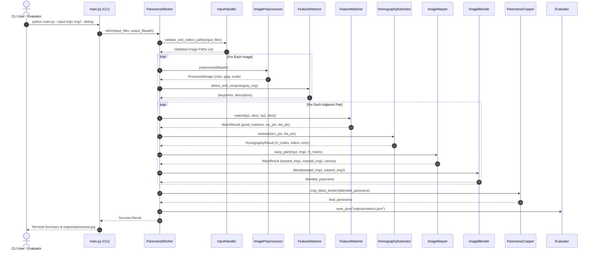

# Sequence Diagram

The sequence diagram details object interactions during a multi-image panorama stitching pipeline execution.

```mermaid
sequenceDiagram
    autonumber
    actor User as CLI User / Evaluator
    participant Main as main.py (CLI)
    participant Stitcher as PanoramaStitcher
    participant Input as InputHandler
    participant Prep as ImagePreprocessor
    participant Feature as FeatureDetector
    participant Matcher as FeatureMatcher
    participant Homo as HomographyEstimator
    participant Warp as ImageWarper
    participant Blend as ImageBlender
    participant Crop as PanoramaCropper
    participant Eval as Evaluator

    User->>Main: python main.py --input img1 img2 --debug
    Main->>Stitcher: stitch(input_files, output_filepath)
    Stitcher->>Input: validate_and_collect_paths(input_files)
    Input-->>Stitcher: Validated Image Paths List

    loop For Each Image
        Stitcher->>Prep: preprocess(filepath)
        Prep-->>Stitcher: ProcessedImage (color, gray, scale)
        Stitcher->>Feature: detect_and_compute(gray_img)
        Feature-->>Stitcher: (keypoints, descriptors)
    end

    loop For Each Adjacent Pair
        Stitcher->>Matcher: match(kp1, des1, kp2, des2)
        Matcher-->>Stitcher: MatchResult (good_matches, src_pts, dst_pts)
        Stitcher->>Homo: estimate(src_pts, dst_pts)
        Homo-->>Stitcher: HomographyResult (H_matrix, inliers, error)
        Stitcher->>Warp: warp_pair(img1, img2, H_matrix)
        Warp-->>Stitcher: WarpResult (warped_img1, warped_img2, canvas)
        Stitcher->>Blend: blend(warped_img1, warped_img2)
        Blend-->>Stitcher: blended_panorama
    end

    Stitcher->>Crop: crop_black_borders(blended_panorama)
    Crop-->>Stitcher: final_panorama
    Stitcher->>Eval: save_json("outputs/metrics.json")
    Stitcher-->>Main: Success Result
    Main-->>User: Terminal Summary & outputs/panorama.jpg
```
