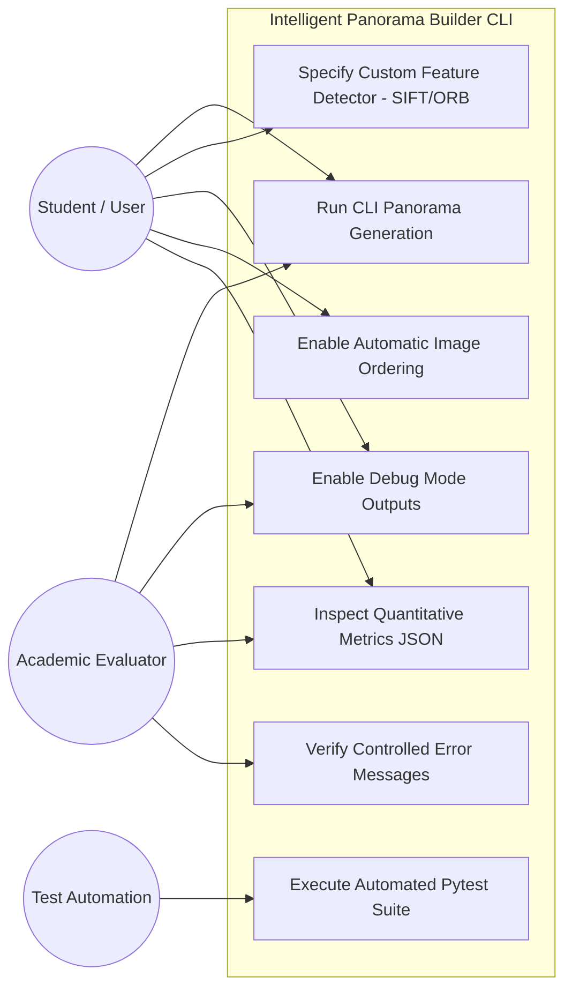

# Use Case Diagram

The use case diagram models interactions between actors (Evaluator, Student/User, Test Automation Script) and system features.

## Use Case Specifications
- **UC1: Run CLI Panorama Generation**: User passes image paths or a directory via command line to produce a stitched panoramic image.
- **UC2: Specify Custom Feature Detector**: User selects SIFT or ORB algorithm and custom Lowe's ratio test thresholds.
- **UC3: Enable Debug Mode Outputs**: Evaluator inspects intermediate keypoint visualizers, match correspondence lines, homography text files, and warped frames.
- **UC4: Enable Automatic Image Ordering**: System reorders input images based on feature overlap matrix.
- **UC5: Inspect Quantitative Metrics JSON**: Evaluator reviews objective performance indicators (inlier ratio, reprojection error, processing time).
- **UC6: Execute Automated Pytest Suite**: Runs unit and end-to-end integration tests to verify code stability.
- **UC7: Verify Controlled Error Messages**: Ensures invalid inputs, missing files, or low match count images raise human-readable error messages without crashing.
