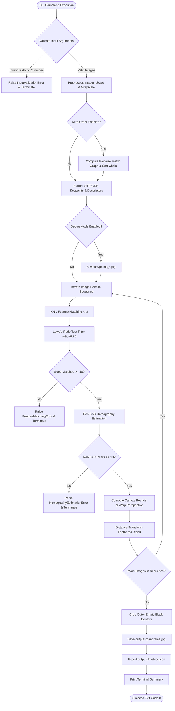

# Workflow / Process Flow Diagram

The process flow diagram illustrates the sequential execution lifecycle of the panorama stitching system.

```mermaid
flowchart TD
    Start([CLI Command Execution]) --> InputVal{Validate Input Arguments}
    InputVal -->|Invalid Path / < 2 Images| ErrorExit[Raise InputValidationError & Terminate]
    InputVal -->|Valid Images| Preprocess[Preprocess Images: Scale & Grayscale]
    Preprocess --> ReorderCheck{Auto-Order Enabled?}
    ReorderCheck -->|Yes| Reorder[Compute Pairwise Match Graph & Sort Chain]
    ReorderCheck -->|No| DetectFeatures[Extract SIFT/ORB Keypoints & Descriptors]
    Reorder --> DetectFeatures
    
    DetectFeatures --> DebugKP{Debug Mode Enabled?}
    DebugKP -->|Yes| SaveKP[Save keypoints_*.jpg]
    DebugKP -->|No| PairLoop
    SaveKP --> PairLoop[Iterate Image Pairs in Sequence]
    
    PairLoop --> KNNMatch[KNN Feature Matching k=2]
    KNNMatch --> RatioTest[Lowe's Ratio Test Filter ratio=0.75]
    RatioTest --> GoodMatchCheck{Good Matches >= 10?}
    GoodMatchCheck -->|No| MatchError[Raise FeatureMatchingError & Terminate]
    GoodMatchCheck -->|Yes| Homography[RANSAC Homography Estimation]
    
    Homography --> InlierCheck{RANSAC Inliers >= 10?}
    InlierCheck -->|No| HomoError[Raise HomographyEstimationError & Terminate]
    InlierCheck -->|Yes| Warp[Compute Canvas Bounds & Warp Perspective]
    
    Warp --> Blend[Distance-Transform Feathered Blend]
    Blend --> NextPair{More Images in Sequence?}
    NextPair -->|Yes| PairLoop
    NextPair -->|No| Crop[Crop Outer Empty Black Borders]
    
    Crop --> SavePanorama[Save outputs/panorama.jpg]
    SavePanorama --> SaveMetrics[Export outputs/metrics.json]
    SaveMetrics --> TerminalSummary[Print Terminal Summary]
    TerminalSummary --> End([Success Exit Code 0])
```
